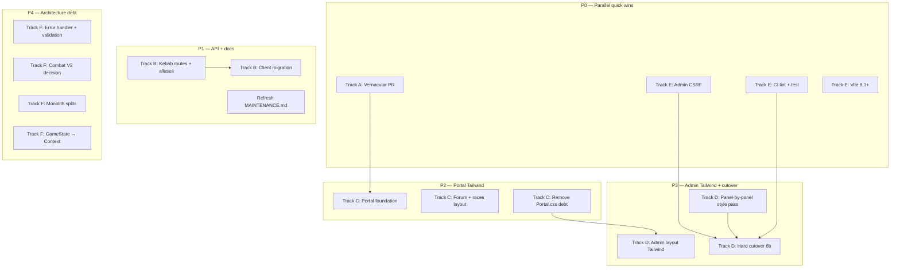

# Narmir Reborn — Alpha Roadmap

**Status:** Alpha — move fast, draft PRs, lint + smoke on every commit.  
**Last updated:** 2026-06-26  
**Supersedes for planning:** defers `AdminRoadmap.md` dogfood gate; incorporates `MAINTENANCE.md` priorities.

This document is the single planning source for vernacular alignment, API hygiene, Portal/Admin Tailwind cutovers, platform health, and deferred architecture work. Detailed admin parity checklists remain in `AdminRoadmap.md` §3 and §6.

---

## Executive summary

| Area | Today | Target |
|------|-------|--------|
| Game nav labels | Sidebar + bottom nav aligned | ✅ **Offense** + **Wherewithal** (`fix/topbar-take-turn`) |
| Admin tab label | **Configs** | ✅ **Config** (singular) |
| Alliance copy | Panel meta **Alliance**; some UI still plural | ✅ Singular panel titles; plural only in list copy |
| API paths | Mixed kebab + snake_plural | ✅ Kebab canonical + legacy aliases (`dualRoute`) |
| Portal | React + Tailwind foundation + `portal-content.css` | ✅ C1/C2 done; C3 CSS debt remains |
| Forums | phpBB-style index in portal + in-game panel | ✅ 4 categories × 4 boards, avatars, badges, scroll |
| Admin | React default at `/admin`; **inline styles** throughout; legacy `?legacy=1` | Tailwind shell + panels; hard cutover; archive `public/admin.html` |
| Splash / glitch | Frameset clone + CSS-only glitch (`public/retro/*`) | ✅ S0 done — standalone entry unchanged |
| Platform health | Lint + CI + admin CSRF | ✅ E1/E2 done; E3 Vite bump open |
| Dogfood | AdminRoadmap Phase 6a soak | **Deferred** — alpha proceeds to 6b when verification matrix passes |

---

## Principles (alpha)

1. **Draft PRs only** — per `Claude.md`; never self-merge.
2. **Lint → smoke → sanity** before every commit; session URL in commit messages.
3. **Panel IDs stay stable** — `warfare`, `economy`, `alliances` hash routes unchanged; only display labels change.
4. **Backward-compatible APIs** — add canonical kebab routes; keep snake_plural aliases until clients migrated; remove aliases post-beta.
5. **Splash is not portal** — separate Vite entry, separate CSS; share only design tokens (`tailwind.css` variables), not layout/components.
6. **Glitch stays as-is** — CSS-driven sequence in `Splash.jsx` / `Splash.css`; optional polish only (see §7).

---

## Dependency graph (PR tracks)



**Suggested merge order:** P0 tracks in parallel → B1/B2 + M1 → C1→C2→C3 (can overlap with D1) → D2 → D3.

---

## Track A — Vernacular & naming (P0)

**Goal:** One voice across game shell, admin, and player-facing copy. No route or panel ID changes.

### A.1 Game navigation

| Location | File | Current | Target |
|----------|------|---------|--------|
| Bottom nav core tab | `client/src/components/react/BottomNav.jsx` | `warfare` → **War** | **Offense** |
| Bottom nav core tab | same | `economy` → **Economy** | **Wherewithal** |
| Sidebar panel buttons | `client/src/utils/panelMeta.js` | `warfare` → **Offense** | ✅ already correct |
| Sidebar section header | `panelMeta.js` `NAV_SECTIONS` | **Wherewithal** | ✅ already correct |
| Sidebar sub-panel | `panelMeta.js` | `economy` → **Economy** | Keep **Economy** (panel within Wherewithal section) |

**Rationale:** Mobile core tabs mirror section “home” panels: Wherewithal → `economy` panel, Warfare → `warfare` panel (**Offense**). Sub-panels (Market, Resources) keep descriptive names.

### A.2 Admin & config

| Location | Current | Target |
|----------|---------|--------|
| `client/src/admin/AdminTabNav.jsx` | **Configs** | **Config** |
| `public/admin.html` (until archived) | “Configs” tab | **Config** |
| `AdminRoadmap.md` §3 tab name | Configs | **Config** (doc sync) |

### A.3 Alliance (singular globally)

| Keep plural | Change to singular / context-aware |
|-------------|-------------------------------------|
| “Browse alliances with open slots” (grammar) | Panel title: **Alliance** (`panelMeta` ✅) |
| API/list variable names (`openAlliances`) | Card title **Open Alliances** → **Join an Alliance** or **Open Alliance List** |
| `AlliancesPanel` component filename | Defer rename (import churn); optional P3 cleanup |

**Files to audit:** `AlliancesPanel.jsx`, `RankingsPanel.jsx` (alliance rankings sub-tab label), `TestingPanel.jsx` test labels, `ChangelogPanel.jsx` lore copy.

### A.4 PR plan

| PR | Branch | Scope | Exit criteria |
|----|--------|-------|---------------|
| **A1** | `fix/nav-vernacular` | BottomNav, AdminTabNav, Alliance UI strings | Lint 0 errors; smoke baseline; visual check mobile + desktop |

**Sanity:** Grep `label: 'War'`, `Configs`, panel titles; confirm hash `#warfare` / `#economy` unchanged.

---

## Track B — API route normalization (P1)

**Problem:** `routes/admin.js` mixes RESTful kebab (`/ai/seed`, `/events/create`) with snake_plural (`/bug_reports`, `/admin_notes`, `/changelog_entries`, `/random_events`, `/junk_events`, `/tax_events`). Clients: `EvolutionPanel.jsx`, `LorePanel.jsx`, legacy `public/admin.html`.

### B.1 Canonical convention (alpha)

| Rule | Example |
|------|---------|
| Kebab-case path segments | `/bug-reports`, `/admin-notes` |
| Plural only for true collections | `/bug-reports` (many reports), `/config` (singleton editor stays singular) |
| Nested resources | `/events/log`, `/events/list` (unchanged — already good) |
| DB table names | **Unchanged** (`bug_reports`, etc.) — routing layer only |

### B.2 Migration map

| Legacy (deprecate) | Canonical | Methods |
|--------------------|-----------|---------|
| `/api/admin/bug_reports` | `/api/admin/bug-reports` | GET |
| `/api/admin/admin_notes` | `/api/admin/admin-notes` | GET, POST, DELETE `/:id` |
| `/api/admin/changelog_entries` | `/api/admin/changelog-entries` | GET, POST |
| `/api/admin/random_events` | `/api/admin/random-events` | GET, POST, PUT `/:id`, DELETE `/:id` |
| `/api/admin/junk_events` | `/api/admin/junk-events` | GET, POST, DELETE `/:id` |
| `/api/admin/tax_events` | `/api/admin/tax-events` | GET, POST, DELETE `/:id` |

**Implementation pattern:**

```js
// routes/admin.js — register canonical first, alias legacy
function mountAdminResource(router, { canonical, legacy, handlers }) {
  Object.entries(handlers).forEach(([method, path, fn]) => {
    router[method](canonical + path, fn);
    if (legacy) router[method](legacy + path, fn);
  });
}
```

Optional: `Deprecation` response header on legacy paths (`Sunset: post-beta`).

### B.3 Client updates

1. `client/src/admin/panels/EvolutionPanel.jsx` — switch `adminFetch` to canonical paths.
2. `client/src/admin/panels/LorePanel.jsx` — `EventPoolSection` `endpoint` prop → kebab.
3. `public/admin.html` — update if still served via `?legacy=1`; or freeze legacy and document “canonical only” in React.

### B.4 PR plan

| PR | Branch | Scope |
|----|--------|-------|
| **B1** | `fix/admin-api-kebab` | Server aliases + canonical routes |
| **B2** | `fix/admin-api-clients` | React admin client paths; grep repo for old paths |

**Exit criteria:** React admin fully on canonical paths; legacy aliases return same payloads; smoke + manual Evolution/Lore tab check.

**Out of scope (P4):** Renaming `/api/kingdom/*` or forum routes — document-only for now.

---

## Track C — Portal → React + Tailwind (P2)

**Current state:**

- Entry: `client/portal.html` → `client/src/portal-main.jsx` → `Portal.jsx`
- Styles: `Portal.css` (~large), `client/src/css/forum.css`
- **Missing:** `import './tailwind.css'` (game and admin already import it)

### C.1 Target architecture

```
client/portal.html
  └── portal-main.jsx
        ├── tailwind.css          ← theme tokens, @layer components
        ├── Portal.jsx            ← layout only; Tailwind utilities
        └── components/forum/*    ← migrate off forum.css gradually
```

Shared with game: CSS variables (`--gold`, `--void-950`, `.card`, `.base-btn` from `tailwind.css`). **Do not** mount `GameShell` or share game panels.

### C.2 Phased work

| Phase | Work | Notes |
|-------|------|-------|
| **C1 Foundation** | Add `tailwind.css` to `portal-main.jsx`; Tailwind `@source` includes `Portal.jsx` if needed; port portal header/footer/nav to utilities | Keep `Portal.css` temporarily with reduced scope |
| **C2 Forum + content** | `ForumSection`, race cards, auth CTAs → Tailwind; extract repeated patterns to `@layer components` (`.portal-hero`, `.race-card`) | Match game typography (Cinzel + Inter already in `portal.html`) |
| **C3 CSS removal** | Delete or shrink `Portal.css` / `forum.css` to zero; visual regression pass desktop + mobile | Smoke: `curl /portal` + forum boards API |

### C.3 PR plan

| PR | Branch | Scope |
|----|--------|-------|
| **C1** | `feat/portal-tailwind-foundation` | Import chain + shell layout |
| **C2** | `feat/portal-tailwind-forum` | Forum + race grid |
| **C3** | `feat/portal-tailwind-cleanup` | Remove legacy CSS files |

**Exit criteria:** No required `Portal.css` for layout; portal visually on-par with current production; lint + smoke pass.

### C.4 Forum overhaul ✅ DONE (`fix/topbar-take-turn`)

| Area | Delivered |
|------|-----------|
| **Index** | `GET /api/forum/index` — 4 categories (Community, Warfare, Alliances, **Roleplaying**), 4 sub-boards each, topic/post counts, last activity |
| **Seed** | `lib/forum-seed.js` — migrates legacy flat boards on boot |
| **Avatars** | `forum_profiles` table; initials / Gravatar / custom URL; `ForumAvatarSettings` modal |
| **Badges** | RP-weighted (`lib/forum-badges.js`) — Tavern Regular, Storyweaver, Chronicler, Questgiver, etc. |
| **In-game** | `ForumPanel.jsx` full-bleed shell panel; theme-aware `forum.css`; scrollable index |
| **Portal** | Shared `ForumSection` + `forum.css` via `portal-main.jsx`; color theme picker |

**Next (optional):** C3 shrink `Portal.css` / `forum.css`; forum profile page; badge tooltips in index.

---

## Track D — Admin → Tailwind hard cutover (P3)

**Current state (post Phase 6a):**

- React default: `/admin` via `client/src/admin-main.jsx` + `tailwind.css` import ✅
- **But:** ~20 admin files still use heavy `style={{}}` inline objects (grep: 500+ inline style usages)
- Legacy: `public/admin.html` (~4,842 lines), `?legacy=1` fallback
- `AdminRoadmap.md` Phase 6b blocked on dogfood — **skipped in alpha**

### D.1 Alpha cutover policy

| AdminRoadmap item | Alpha decision |
|-------------------|----------------|
| Dogfood ≥1 week | **Deferred** — proceed when verification matrix (§6b checklist) is complete |
| `?legacy=1` | Remove in **D3** after one full matrix pass on staging/local |
| `public/admin.html` | Move to `public/legacy/admin.html` (read-only archive) |

### D.2 Tailwind migration strategy

1. **Shell first** (`AdminShell`, `AdminTabNav`, `AdminStatGrid`, `AdminToast`) — replace inline styles with utilities matching game shell (topbar, cards, tab scroll).
2. **High-traffic panels** — `KingdomsPanel`, `ManagePanel`, `ConfigPanel`.
3. **Long-tail panels** — `EvolutionPanel`, `EventsPanel`, `LorePanel`, `KingdomEditModal` / `KingdomWidgets`.
4. **Shared primitives** — extend `client/src/tailwind.css` `@layer components` with `.admin-table`, `.admin-tab`, `.admin-stat` (per `AdminRoadmap.md` §4.4).

### D.3 Hard cutover checklist (from AdminRoadmap §6b)

Run once before **D3**; all must pass:

- Manage, Kingdoms (+ AI preset), Events, Config, Sounds, Prestige, Lore, Evolution (wishlist + changelog + notes), Detailed Lists (fragments + spells), Goals, Security audit (CSRF), Auth logout/login.

### D.4 PR plan

| PR | Branch | Scope |
|----|--------|-------|
| **D1** | `feat/admin-tailwind-shell` | Shell + tab nav + toast + stat grid |
| **D2a–d** | `feat/admin-tailwind-panels-*` | Split by panel groups (4 PRs max for reviewability) |
| **D3** | `feat/admin-hard-cutover` | Remove legacy flag; archive `admin.html`; update `serveAdmin()`; README |

**Exit criteria:** No inline layout styles in shell; `GET /admin` React-only; parity checklist ✅; lint + smoke + `GET /admin` returns admin root.

---

## Track E — Platform health (`MAINTENANCE.md`) (P0–P1)

### E.1 Status refresh (2026-06-26 audit)

| MAINTENANCE item | Current status | Action |
|------------------|----------------|--------|
| ESLint broken | **Fixed** — `npm run lint` exits 0 | Update `MAINTENANCE.md` §1 |
| Admin CSRF gaps | **Fixed** — router-level CSRF on all admin mutators | ✅ E1 |
| CI tests | **Fixed** — `.github/workflows/ci.yml` lint + test + build | ✅ E2 |
| Vite 8.0.12 | **Open** | **E3** — bump to ≥8.1.0 |
| Dependency advisories | Open | Track in E3/E2 `npm audit` (non-blocking warnings OK with justification) |
| Monoliths / combat V2 | Open | Track F (P4) |

### E.2 PR plan

| PR | Branch | Scope | Priority |
|----|--------|-------|----------|
| **E1** | `fix/admin-csrf` | `requireCsrfToken` on all mutating `routes/admin.js` routes; ensure React `adminFetch` sends CSRF | P0 |
| **E2** | `ci/lint-test-build` | New workflow: `npm ci`, `npm run lint`, `npm test`, `npm run build` | P0 |
| **E3** | `chore/vite-bump` | `vite` ≥8.1.0; verify dev + production build | P1 |
| **M1** | `docs/maintenance-refresh` | Rewrite `MAINTENANCE.md` with current status + link to this roadmap | P1 |

### E.3 CSRF scope (E1)

Apply `requireCsrfToken` to every admin mutator not yet covered, including:

`ban`, `unban`, `promote`, `reset-*`, `set-kingdom`, `announce`, `ai-hiatus`, `ai/seed`, `ai/reset`, `ai/apply-preset`, `config` POST, `flush-*`, `events/*`, `lore` POST/PUT/DELETE, event pools, `wishlist/*`, `goals/*`, `changelog-entries` POST, etc.

Already protected: `sounds/upload`, `sounds/delete`, `repair-resource-allocations`, `security-audit`.

React admin already uses cookie + CSRF via `adminFetch` / `apiCall` — legacy `public/admin.html` is the fragile consumer until D3.

---

## Track F — Architecture debt (P4, post-cutover)

Deferred until Tracks A–E and portal/admin Tailwind are stable. Pulled from `MAINTENANCE.md` recommended order.

| ID | Work | Notes |
|----|------|-------|
| **F1** | Express global error handler; audit silent `catch {}` in `kingdom.js` | Medium priority |
| **F2** | Server-side numeric range validation (troops, builds, research) | Prevents balance exploits |
| **F3** | Combat V2 decision — complete `USE_COMBAT_V2` or remove branch | Requires design sign-off |
| **F4** | Split `routes/kingdom.js` → `build`, `warfare`, `economy`, `research` modules | Incremental |
| **F5** | `game/engine.js` decomposition | Long horizon |
| **F6** | `GameStateManager` → React Context (incremental per panel) | Align with frontend tests |
| **F7** | Frontend component tests (Vitest + RTL) | Start with shell nav + `panelMeta` |
| **F8** | Duplicate `timestamp.js` / `lib/timestamp-utils.js` | Single module |

---

## §7 Splash & glitch (standalone)

**Policy:** Splash remains a **separate product surface** — not folded into portal or game migration. The retro phase is a **rendition of the original** [narmir.com/varuh](http://www.narmir.com/varuh/) frameset that glitches into Narmir Reborn.

| Asset | Role |
|-------|------|
| `client/splash.html` + `splash-main.jsx` | Entry |
| `public/retro/*` | Self-hosted original chrome (bg-left/right, bg-top, nav images) |
| `Splash.jsx` + `Splash.css` | Frameset clone → CSS-only glitch → modern sequence |
| `OptionsPanel` | `narmir_skip_glitch` preference |

### S0 — Asset-first frameset clone (Option 1) ✅ DONE

| Item | Detail |
|------|--------|
| Layout | CSS grid `140px \| 1fr \| 140px` matching `cols="140,*,140"` |
| Left nav | Image buttons from `left.html` on `bg-left.gif` |
| Center | `bg-top.jpg` banner + `gamemain.html` copy (black bg, Verdana 8pt) |
| Right | `bg-right.gif` decorative gutter |
| Glitch | CSS-only (`.glitching`); removed 75ms `setInterval` text corruption |
| Applet | Static 200×75 placeholder where Java launcher was |

**Assess:** Load `/` or splash route with `?replay=1` to force retro phase.

### Optional follow-ups (P3+)

| Suggestion | Effort | Benefit |
|------------|--------|---------|
| `prefers-reduced-motion: reduce` → skip to modern phase | Low | Accessibility |
| Extract `useSplashPhase()` hook | Low | Testability |
| Do **not** port glitch keyframes to Tailwind | — | Keep in `Splash.css` |

**Splash Tailwind:** Not planned — standalone CSS + assets only.

---

## Verification matrix (every PR)

Per `Claude.md`:

1. `npm run lint` — 0 errors  
2. Fresh server boot + `PostgreSQL connected successfully`  
3. Baseline smoke: forum boards, auth/me, portal, game entry  
4. Track-specific checks (nav labels, `/admin`, portal render, API paths)  
5. Sanity questions answered in commit message or PR body  

---

## Immediate next steps (recommended sprint)

| Order | PR | Owner intent |
|-------|-----|--------------|
| **1** | **S0** `feat/splash-frameset-retro` | ✅ Done — frameset clone + CSS-only glitch |
| **2** | **A1** `fix/nav-vernacular` | ✅ Done — Offense, Wherewithal, Config, Alliance copy |
| **3** | **E1** `fix/admin-csrf` | ✅ Done — router-level CSRF on all admin mutators |
| **4** | **E2** `ci/lint-test-build` | ✅ Done — `.github/workflows/ci.yml` + `npm test` |
| **5** | **B1+B2** API kebab | ✅ Done — `dualRoute()` + React admin client paths |
| **6** | **C1+C2** Portal tailwind + forum layout | ✅ Done — `tailwind.css`, `portal-content.css`, themed forums |
| **7** | **Forum overhaul** | ✅ Done — categorized index, RP boards, avatars, badges, in-game panel |
| **8** | **D1** Admin tailwind shell | Next — shell + tab nav inline-style removal |
| **9** | **C3** Portal CSS cleanup | Shrink `Portal.css` / `forum.css` debt |
| **10** | **D3** Hard cutover when matrix green | No dogfood wait |

---

## Related documents

| Doc | Relationship |
|-----|--------------|
| `AdminRoadmap.md` | Admin parity detail; Phase 6b checklist; dogfood **deferred** per this doc |
| `MAINTENANCE.md` | Health audit; refresh via **M1** after E1–E3 |
| `Claude.md` | PR workflow, smoke recipe, commit rules |
| `TODO.md` | Combat V2 and feature-level todos |

---

*Document version: 1.1 — 2026-06-26 (merged via `fix/topbar-take-turn`)*