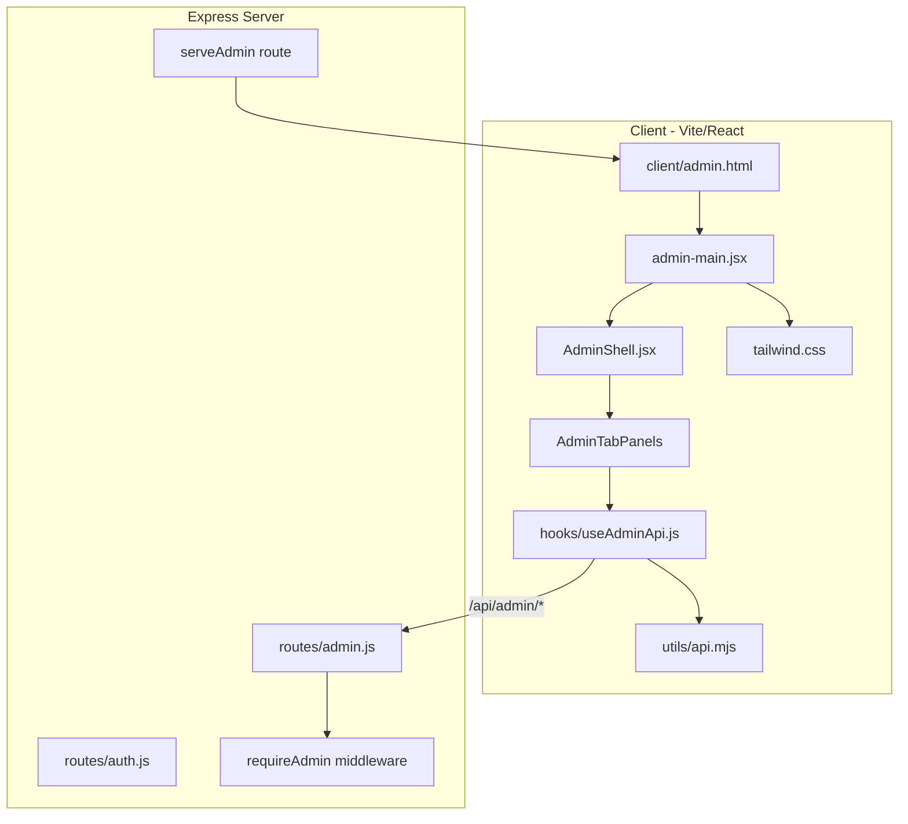

# Admin Panel React + Tailwind Migration Roadmap

**Status:** Phase 2c in progress — AI backend APIs + AiKingdomPanel implemented  
**Source of truth audited:** `public/admin.html` (~5,150 lines), `routes/admin.js` (~1,580 lines), `index.js` route wiring  
**Target:** Replace the monolithic vanilla HTML admin with a Vite/React/Tailwind app matching the game shell and portal patterns

---

## 1. Executive summary

The current admin panel is a self-contained `public/admin.html` file with ~650 lines of inline CSS, ~3,000 lines of inline JavaScript, and 12 top-level tabs. It works, but it is difficult to maintain, inconsistently secured, partially disconnected from backend APIs, and visually divergent from the React game shell.

This roadmap defines a **phased, low-risk migration** to:

1. A dedicated React entry (`client/admin.html` + `client/src/admin-main.jsx`)
2. Shared Tailwind theme tokens (`client/src/tailwind.css`)
3. Shared API utilities (`client/src/utils/api.mjs`)
4. Modular admin feature panels under `client/src/admin/`
5. **New capability:** one-click AI kingdom combat/economy presets (High Defense, High Attack, Balanced, Fighter Heavy, etc.)

The migration preserves **100% feature parity** with the legacy panel before cutover, fixes known backend gaps, and only then retires `public/admin.html`.

---

## 2. Current state audit

### 2.1 File anatomy (`public/admin.html`)

| Layer | Approx. size | Notes |
|-------|-------------|-------|
| Inline `<style>` | ~650 lines | Duplicates game CSS variables manually; not synced with theme picker |
| HTML structure | ~1,450 lines | 12 tabs, 4 modals, nested sub-tabs |
| Inline `<script>` | ~3,050 lines | Monolithic IIFE-style functions, string-built DOM |
| **Total** | **~5,150 lines** | Single file; no tests, no lint coverage |

### 2.2 Serving model (today)

```
GET /admin, /admin.html  →  res.sendFile(public/admin.html)   [index.js]
```

Unlike `/game` and `/portal`, admin is **not** processed by Vite in dev or served from `dist/` in production. It bypasses the React toolchain entirely.

### 2.3 Authentication flow (today)

1. Login form posts to `/api/auth/login`
2. On success, stores JWT in `localStorage` key `narmir_token`
3. Sends `x-auth-token` header on all admin API calls
4. Boot check: `GET /api/auth/me` — if `isAdmin`, skip login screen

**Edge cases to preserve:**

| Case | Current behavior | React target |
|------|------------------|--------------|
| Valid cookie, no localStorage token | `/api/auth/me` works via cookie | Use `apiCall` with `credentials: 'include'` only; stop relying on localStorage as primary |
| Expired token | API returns 401; UI may show stale data | Global 401 handler → force re-auth screen |
| Non-admin login | Shows "Not an admin account" | Same; never mount admin routes |
| Admin promoted mid-session | Old JWT lacks `isAdmin` until re-login | Show banner: "Re-login to refresh admin token" (matches README/setup-admin flow) |
| Logout | Clears localStorage + POST `/api/auth/logout` | Clear query caches; redirect to auth gate |

### 2.4 API coverage map

All routes live under `/api/admin/*` with `router.use(requireAdmin)` in `routes/admin.js`.

#### Working endpoints (used by admin.html today)

| Group | Methods | Purpose |
|-------|---------|---------|
| Overview | `GET /stats`, `GET /kingdoms` | Dashboard + kingdom table |
| Players | `POST /ban`, `POST /unban`, `POST /promote` | Moderation |
| Kingdoms | `GET /kingdom-detail/:id`, `POST /set-kingdom`, `POST /reset-kingdom`, `POST /reset-all-kingdoms`, `DELETE /kingdom/:id`, `POST /reset-turns`, `POST /reset-turns-all` | Kingdom editor + bulk ops |
| AI control | `GET /ai-hiatus`, `POST /ai-hiatus` | Pause AI turns globally |
| Chat mods | `GET /chat-mods`, `GET /chat-bans`, `POST /chat-mod`, `POST /chat-unban` | Chat moderation |
| Announce | `POST /announce` | Socket.io global broadcast |
| Test data | `POST /test-kingdoms/setup` | Provision 9 race test kingdoms |
| Bulk flush | `POST /flush-locations`, `POST /flush-support-troops` | Dangerous world-state resets |
| Config | `GET /config`, `POST /config` | `game/config` + `config_overrides.json` editor |
| Seasonal events | `GET /events/log`, `GET /events/list`, `POST /events/create`, `POST /events/update`, `POST /events/delete` | Admin event CRUD + log |
| Lore / trips | `GET/POST /lore`, `PUT/DELETE /lore/:id` | Lore entries |
| Random events | `GET/POST /random_events`, `PUT/DELETE /random_events/:id` | Expedition random events |
| Junk / tax events | `GET/POST/DELETE /junk_events`, `/tax_events` | Library/tax event pools |
| Sounds | `GET /sounds`, `POST /sounds/upload`, `POST /sounds/delete` | File upload to `public/sounds/` |
| Fragments ref | `GET /fragments` | Read-only fragment metadata |
| Goals | `GET /goals`, `POST /goals/edit`, `/add`, `/remove` | In-memory goal overrides |
| Notes / wishlist | `GET/POST/DELETE /admin_notes`, `GET/POST /wishlist`, `POST /wishlist/:id/complete` | Evolution tab |
| Suggestions | `GET /suggestions` | Player suggestions feed |
| Maintenance | `POST /repair-resource-allocations` | Per-kingdom engineer repair |
| Security | `POST /security-audit` | AST security scanner |

#### Broken / missing endpoints (called by admin.html but **not implemented**)

| Frontend call | Status | Impact |
|---------------|--------|--------|
| `GET /api/admin/ai-synopsis` | **Missing** | AI synopsis table always empty/errors |
| `POST /api/admin/seed-ai` | **Missing** | "Seed AI kingdoms" button non-functional |
| `POST /api/admin/reset-ai` | **Missing** | "Reset AI kingdoms" button non-functional |

`players.is_ai` exists in schema and is surfaced in game UI (rankings, warfare, world map), but **no server-side AI seeding or turn logic** was found in `game/` or `routes/`. This is a prerequisite for both legacy fixes and the new preset system.

#### Backend hygiene issues to fix during migration

| Issue | Location | Risk |
|-------|----------|------|
| Duplicate `DELETE /kingdom/:id` handler | `routes/admin.js` lines ~853 and ~881 | Second handler is dead code; confusing for audits |
| Duplicate `POST /announce` comment block | `routes/admin.js` ~637 and ~815 | Comment drift; only one handler is real |
| CSRF required on some routes only | `sounds/*`, `repair-resource-allocations`, `security-audit` | Legacy `api()` helper sends **no CSRF token**; security audit uses raw `fetch` without CSRF → **will 403** when cookie auth is used |
| `set-kingdom` sends all EDIT_SECTIONS fields on every save | `confirmEdit()` | Empty strings become `null`; unchanged JSON blobs still POSTed — risk of accidental overwrites |
| Kingdom table `onclick` with `escQ()` only | `renderTable()` | Names with `"` or complex Unicode can break attribute escaping |
| `editEvent()` passes `JSON.stringify(e).replace(/"/g, "'")` into HTML | Events tab | Fragile; fails on nested quotes |

---

## 3. Feature inventory (parity checklist)

Each row must reach ✅ before retiring `public/admin.html`.

### Tab: Manage (`atab-manage`)

| Feature | API | Edge cases |
|---------|-----|------------|
| Global announcement | `POST /announce` | Empty message; Socket.io offline; XSS in message display in game chat |
| Chat mod promote/demote | `POST /chat-mod` | Unknown username; demoting last mod |
| Chat ban list + unban | `GET /chat-bans`, `POST /chat-unban` | Empty list; user not found |
| Promote to admin | `POST /promote` | Already admin; player not found |
| Race test kingdoms | `POST /test-kingdoms/setup` | Prefix validation; password < 8 chars; `resetExisting` false preserves custom edits; 9 races loop |

### Tab: Kingdoms (`atab-kingdoms`)

| Feature | API | Edge cases |
|---------|-----|------------|
| Kingdom table + search | `GET /kingdoms` | Large server (500+ kingdoms) → virtualize table |
| Per-row: Edit / Reset / +Turns / Ban / Delete | various | Confirm dialogs; banned vs active; admin badge |
| Reset all turns | `POST /reset-turns-all` | No confirm in legacy — **add confirm in React** |
| Reset all kingdoms | `POST /reset-all-kingdoms` | Destructive; race-specific reset values |
| Seed / Reset AI | **missing APIs** | Must implement backend first |
| Flush locations | `POST /flush-locations` | Irreversible; all players lose map progress |
| Flush support troops | `POST /flush-support-troops` | Zeroes researchers/engineers/scribes globally |
| AI hiatus toggle | `GET/POST /ai-hiatus` | Server restart loses in-memory state? (persisted in `server_state`) |
| AI synopsis table | **missing API** | Columns: land, pop, gold, happiness, food, military, W/L, ops, hit, turns, top build/research |

### Tab: Kingdom editor modal (largest complexity)

Driven by `EDIT_SECTIONS` (~150 lines) with **11 section types**:

| Section | Field types | Serialization edge cases |
|---------|-------------|---------------------------|
| Attributes | text/number | `race` change does not recalc land/buildings |
| Resources | number | `gold` > MAX_SAFE_INTEGER rejected; `turns_stored` not capped at 400 in editor |
| Units | number | Vampire kingdoms may use `thralls` not `clerics`; zero vs empty |
| Buildings | number | 30+ `bld_*` columns; resource buildings separate |
| Research | number | Values are 0–1000 scale in game, editor allows any int32 |
| Fragments | custom UI | 10 fragments; owned/studied coupling; JSON array format |
| Troops | troop-levels | Preserves `count` from original JSON only |
| Magic & effects | effects-list, items | Effect objects preserve unknown keys via `data-original-effect` |
| Construction | kv-numbers | Dynamic keys via prompt — typo keys persist to DB |
| Misc | mixed | `wall_defense_type` free text |

**React approach:** Replace string-built HTML with typed field components + a shared `serializeKingdomFields(kingdom, formState)` mirroring `confirmEdit()` exactly. Add golden-file tests comparing legacy vs React serialization for 3 fixture kingdoms.

### Tab: Events (`atab-events`)

| Sub-feature | Notes |
|-------------|-------|
| Event log | Filter by search + season; timezone display (`fired_at` unix) |
| Event definition CRUD | 15+ effect types in `<select>`; `race_only` blank = all races |
| Form state | Edit populates from inline `editEvent()` — replace with controlled React form |

### Tab: Configs (`atab-config`)

| Sub-feature | Notes |
|-------------|-------|
| `CONFIG_CATEGORIES` | ~80+ keys across Economy, Military, Buildings, Exploration |
| Nested object editors | `type: object`, `nested` — recursive JSON editing |
| Save | Writes `game/config_overrides.json`; requires server restart? Document behavior |
| Validation | Invalid JSON can brick balance — confirm before save |

### Tab: Sounds (`atab-sounds`)

| Sub-feature | Notes |
|-------------|-------|
| Category grid | UI, Combat, Economy, etc. — hardcoded `CATEGORIES` array |
| Upload | `multipart/form-data`; magic-byte validation server-side; 10 MB limit |
| CSRF | **Required** — must use `apiCall` + FormData with CSRF header |
| Delete | Confirm; file must stay within `public/sounds/` |

### Tab: Prestige (`atab-prestige`)

Static reference table only — no API. Pure presentational React component.

### Tab: Lore & Trips (`atab-lore`)

| Pool | CRUD |
|------|------|
| Lore entries | add/delete (no inline edit in legacy) |
| Random expedition events | add/delete |
| Junk events | add/delete |
| Tax events | add/delete |

**Edge case:** `addLoreEntry()` uses `prompt()` — replace with proper modal in React.

### Tab: Evolution / Changelog (`atab-changelog`)

| Sub-tab | API |
|---------|-----|
| Dynamic changelog | rendered from wishlist completions |
| Wishlist | `GET/POST /wishlist`, `POST /wishlist/:id/complete` |
| Admin notes | `GET/POST/DELETE /admin_notes` |
| Legacy localStorage migration | On load, migrates `narmir_admin_notes` → API — **preserve this one-time migration** |

### Tab: Detailed Lists (`atab-fragments`)

| Sub-tab | Data source |
|---------|---------------|
| World fragments | `GET /api/admin/fragments` + hardcoded `ALL_FRAGMENTS` |
| Spells | `GET /api/...` spell definitions (loaded in `loadSpellDefinitions()`) |

Read-only reference panels — good candidates for first React port (low risk).

### Tab: Goals (`atab-goals`)

| Feature | Notes |
|---------|-------|
| Daily / weekly / monthly grids | Click card → edit modal |
| Add goal modal | Validates tier, goal_id uniqueness |
| Soft delete | `goals/remove` sets `active = 0`; triggers `refreshInMemoryGoals` |
| Prize types | Whitelist: gold, mana, rangers, researchers, war_machines, world_fragment |

### Tab: Security (`atab-security`)

| Feature | Notes |
|---------|-------|
| Run audit | `POST /security-audit` — **needs CSRF fix** |
| Filter by severity | critical / high / medium / low / positive |
| Long-running | May take 10–30s; show spinner; disable double-submit |

### Related: `public/wipe-admin.html`

Separate one-off wipe tool using `ADMIN_SECRET` (`POST /api/admin/wipe-players`). **Out of scope** for initial React admin, but link from Manage tab or document as deprecated after review.

---

## 4. Target architecture

### 4.1 High-level diagram



### 4.2 Proposed file structure

```
client/
  admin.html                          # Vite entry (mirror portal.html)
  src/
    admin-main.jsx                    # createRoot mount
    admin/
      AdminShell.jsx                  # layout: topbar, stats, tab nav
      AdminAuthGate.jsx               # login / session restore
      hooks/
        useAdminApi.js                # typed wrappers per endpoint group
        useAdminSession.js            # isAdmin gate, 401 handling
        useConfirmAction.js           # destructive action dialogs
      components/
        AdminStatGrid.jsx
        AdminTabNav.jsx
        AdminToast.jsx                # or reuse game ToastProvider
        AdminDataTable.jsx            # virtualized kingdom table
        AdminModal.jsx
        AdminConfirmDialog.jsx
      panels/
        ManagePanel.jsx
        KingdomsPanel.jsx
        KingdomEditModal.jsx          # largest component; split sub-forms
        EventsPanel.jsx
        ConfigPanel.jsx
        SoundsPanel.jsx
        PrestigePanel.jsx
        LorePanel.jsx
        EvolutionPanel.jsx
        FragmentsReferencePanel.jsx
        GoalsPanel.jsx
        SecurityPanel.jsx
        AiKingdomPanel.jsx            # NEW: synopsis + presets
      lib/
        editSections.js               # port EDIT_SECTIONS + serializers
        configCategories.js           # port CONFIG_CATEGORIES
        kingdomFieldTypes.jsx         # fragment, kv, merc, troop-level widgets
        aiPresets.js                  # NEW: preset definitions
    utils/
      api.mjs                         # existing — extend for FormData uploads
```

### 4.3 Vite + server wiring changes (future PRs)

| File | Change |
|------|--------|
| `vite.config.js` | Add `admin: client/admin.html` to `rollupOptions.input` |
| `index.js` | Add `serveAdmin()` mirroring `servePortal()` for dev + prod |
| `index.js` | Keep `GET /admin` → new handler (not `public/admin.html`) |
| `Sidebar.jsx` / `BottomNav.jsx` | Link stays `/admin` — no change needed |

### 4.4 Styling strategy

- Import `client/src/tailwind.css` in `admin-main.jsx` (same as game)
- Reuse existing utility classes: `.card`, `.base-btn`, `.panel`, CSS variables (`--gold`, `--accent1`, etc.)
- Admin-specific layout utilities in `@layer components`:
  - `.admin-stat-grid`
  - `.admin-tab-nav` (horizontal scroll on mobile, like game bottom nav pattern)
  - `.admin-table-scroll`
- **Do not** copy the 650-line inline CSS verbatim — map to Tailwind + existing tokens
- Mobile: preserve iOS `font-size: 16px` on inputs to prevent zoom; horizontal scroll for wide tables

### 4.5 State management

| Data | Strategy |
|------|----------|
| Dashboard stats | React Query / simple `useState` + `loadData()` on interval manual refresh |
| Kingdom list | Cached in context; invalidate on any kingdom mutation |
| Tab-local data | Fetch on tab mount (`showAdminTab` lazy-load pattern) |
| Kingdom editor | Load full detail on modal open; dirty tracking before save |
| Config editor | Local draft state; diff view before save |

No global game state (`useGameState`) — admin is isolated from game shell.

---

## 5. New feature: AI kingdom one-button presets

### 5.1 Problem statement

Today, tuning AI opponents for testing requires manually editing 50+ fields in the kingdom modal. The seed/reset AI buttons do not work (missing APIs). Admins need **fast, repeatable AI profiles** for combat balance testing.

### 5.2 User stories

1. As an admin, I click **"High Defense"** on an AI kingdom and its walls, guard towers, castles, armor research, and defender troop mix update instantly.
2. As an admin, I click **"Fighter Heavy"** and fighters/barracks/training fields spike while mages/thieves drop.
3. As an admin, I apply **"Balanced"** to reset an AI kingdom to a known PvP baseline without running full `reset-kingdom` (which wipes heroes, wars, etc.).
4. As an admin, I multi-select AI kingdoms and apply a preset to all.
5. As an admin, I seed the standard AI roster if missing, then apply presets per race.

### 5.3 Preset catalog (v1)

Each preset is a **partial field patch** applied on top of current kingdom state (not a full wipe). All values must pass existing `set-kingdom` validation.

| Preset ID | Label | Intent | Primary fields touched |
|-----------|-------|--------|------------------------|
| `balanced` | Balanced | Fair PvP sparring partner | Moderate all unit types; res_* ≈ 200; mixed buildings |
| `high_defense` | High Defense | Siege target / turtle | `bld_walls`, `bld_guard_towers`, `bld_castles`, `res_armor`, `res_defense_magic`, `armor_stockpile`, `fighters`+`clerics`, `wall_hp` |
| `high_attack` | High Attack | Aggressive raider | `fighters`, `rangers`, `bld_barracks`, `res_weapons`, `res_military`, `weapons_stockpile`, `war_machines` |
| `fighter_heavy` | Fighter Heavy | Melee blob | `fighters` 80% of military pop, low mages/thieves, `bld_barracks`, `bld_training` |
| `ranged_focus` | Ranger Focus | Archer fortress | `rangers`, `bld_outposts`, `res_weapons`, low fighters |
| `magic_focus` | Magic Focus | Spellcaster kingdom | `mages`, `res_attack_magic`, `res_spellbook`, `bld_mage_towers`, `mana` |
| `covert_ops` | Covert Ops | Thief/ninja pressure | `thieves`, `ninjas`, `res_military` moderate, low open military |
| `economy_boom` | Economy Boom | Trade farm (AI eco test) | `gold`, `bld_markets`, `bld_farms`, `res_economy`, `population` |
| `glass_cannon` | Glass Cannon | High attack, low defense | High attack fields + low walls/guard towers |
| `turn_ready` | Turn Ready | Give AI turns to act | `turns_stored: 400` only |

**Race-aware adjustments (automatic modifiers):**

| Race | Preset modifier |
|------|-----------------|
| `vampire` | `clerics` → 0, boost `thralls`; mausoleum building bump for defense presets |
| `dire_wolf` | Extra `fighters`/`rangers` in military presets |
| `high_elf` | Extra `mages` in magic presets |
| `dwarf` | Extra `bld_smithies`, `war_machines` in defense/attack |
| `wood_elf` | Extra `rangers`, `bld_outposts` in ranged |
| `dark_elf` | Extra `thieves`/`ninjas` in covert |
| `orc` | Extra `fighters`, `bld_training` in fighter_heavy |
| `ogre` | Fighters only in military presets (zero rangers baseline) |
| `human` | No modifier (baseline) |

### 5.4 API design (new backend — prerequisite)

```
POST /api/admin/ai/seed
  → Create AI players + kingdoms for each race (idempotent)
  Response: { ok, created: N, updated: M, kingdoms: [...] }

POST /api/admin/ai/reset
  → resetKingdomLogic for all players where is_ai = 1
  Response: { ok, reset: N }

GET /api/admin/ai/synopsis
  → Per-AI kingdom dashboard row (replaces missing ai-synopsis)
  Response: [{ id, name, race, land, population, gold, happiness, food,
               fighters, ninjas, wins, losses, covert_ops, times_hit,
               turns_stored, top_build, top_research, level }]

POST /api/admin/ai/apply-preset
  Body: { kingdomId?, kingdomIds?, presetId, mode: 'patch'|'replace' }
  → Merges preset patch, applies race modifiers, POST internally to set-kingdom
  Response: { ok, updated: [...fields], kingdomId }

POST /api/admin/ai/apply-preset-bulk
  Body: { presetId, filter: 'all'|'race:orc'|... }
  → Applies to matching AI kingdoms inside a transaction per kingdom
```

**Implementation notes:**

- Store presets in `game/ai-presets.js` (server) and mirror to `client/src/admin/lib/aiPresets.js` for labels/descriptions — **single source of truth on server**; client fetches `GET /api/admin/ai/presets` for display text to avoid drift.
- `apply-preset` must log to `admin_audit_log` table (new) or `event_log` for accountability.
- Reject preset application on non-AI kingdoms unless `force: true` query flag (prevent accidental player griefing).

### 5.5 UI design (React)

Located in `KingdomsPanel` + dedicated `AiKingdomPanel` section:

```
┌─────────────────────────────────────────────────────────────┐
│ 🤖 AI Kingdoms                              [Hiatus toggle] │
├─────────────────────────────────────────────────────────────┤
│ [Seed AI] [Reset AI] [Refresh Synopsis]                     │
├─────────────────────────────────────────────────────────────┤
│ Quick presets (select kingdom row first, or bulk checkbox): │
│ [Balanced] [High Def] [High Atk] [Fighter Heavy] [Ranged] │
│ [Magic] [Covert] [Eco Boom] [Glass Cannon] [Turn Ready]     │
├─────────────────────────────────────────────────────────────┤
│ Synopsis table (virtualized) ...                            │
└─────────────────────────────────────────────────────────────┘
```

**UX edge cases:**

| Action | Guard |
|--------|-------|
| Apply preset | Confirm if target is not `is_ai` |
| Bulk preset | Show count: "Apply High Defense to 6 AI kingdoms?" |
| Preset + hiatus | Preset does not auto-resume AI |
| Partial failure in bulk | Return per-kingdom errors; show toast summary |
| Preset on banned/deleted | 404 gracefully |

---

## 6. Phased migration plan (PR stack)

Each phase is an independent draft PR. Do not delete `public/admin.html` until Phase 6.

### Phase 0 — Foundation (no user-visible change) ✅ MERGED (PR #580)

**Branch:** `admin-react-00-foundation`

- [x] Add `client/admin.html` + `admin-main.jsx` with "Hello Admin" shell
- [x] Wire `serveAdmin()` in `index.js` (dev + prod)
- [x] Add Vite build entry for admin
- [x] `AdminAuthGate` with login + `/api/auth/me` restore
- [x] Feature flag: `?legacy=1` serves old `public/admin.html` for fallback

**Exit criteria:** `/admin` loads React shell; admin login works; lint + smoke pass.

### Phase 1 — Shell + overview parity ✅ MERGED (PR #581)

**Branch:** `admin-react-01-shell`

- [x] `AdminShell` with topbar, stat grid, tab navigation (12 tabs — empty placeholders)
- [x] Port `loadData()` → stats + kingdom list API integration
- [x] `AdminToast` notifications
- [x] Shared `useAdminSession` with 401 redirect

**Exit criteria:** Stats match legacy; tab switching works; mobile tab scroll.

### Phase 2 — Kingdoms tab (highest value)

**Branch:** `admin-react-02-kingdoms`

- [x] Virtualized `AdminDataTable` for kingdoms
- [x] Search, ban/unban modal, delete/reset confirmations
- [x] `KingdomEditModal` — port `EDIT_SECTIONS` field widgets incrementally:
  - [x] PR 2a: scalar fields (attributes, resources, units, buildings, research) — MERGED (PR #582)
  - [x] PR 2b: JSON widgets (world_fragments, fragment_bonuses, troop_levels, active_effects, mercenaries) — MERGED (PR #584)
- [x] Implement `ai/seed`, `ai/reset`, `ai/synopsis`, `ai/apply-preset`, `ai/presets` APIs — PR 2c
- [x] `AiKingdomPanel` with 10 preset buttons wired into KingdomsPanel — PR 2c
- [x] `game/ai-presets.js` server-side preset catalog with race modifiers — PR 2c
- [x] `client/src/admin/lib/aiPresets.js` client-side preset metadata — PR 2c

**Exit criteria:** Edit save produces identical DB state as legacy for fixture kingdoms; AI seed/synopsis work; presets apply correctly per race.

### Phase 3 — Manage + moderation

**Branch:** `admin-react-03-manage`

- [ ] Announcement, chat mods, promote admin, test kingdom provision
- [ ] Bulk actions: reset all turns, reset all kingdoms, flush locations/troops
- [ ] AI hiatus toggle

### Phase 4 — Content editors

**Branch:** `admin-react-04-content`

- [ ] Events tab (log + CRUD)
- [ ] Lore & trips (4 pools)
- [ ] Goals management (3 tiers + modals)
- [ ] Evolution tab (wishlist, notes, changelog)

### Phase 5 — Config, sounds, reference, security

**Branch:** `admin-react-05-config-sounds`

- [ ] Config editor with nested JSON types
- [ ] Sounds upload (FormData + CSRF) / delete / preview
- [ ] Fragments + spells reference (read-only)
- [ ] Prestige reference table
- [ ] Security audit (fix CSRF; streaming results)

### Phase 6 — Cutover + cleanup

**Branch:** `admin-react-06-cutover`

- [ ] Remove `?legacy=1` flag after 1 week dogfood
- [ ] Delete `public/admin.html` (or move to `public/legacy/admin.html` archived)
- [ ] Update `README.md` admin section
- [ ] Add `docs/admin.md` operator guide (optional)

**Exit criteria:** Full parity checklist §3 all ✅; no references to inline admin scripts.

---

## 7. Edge-case master list

### 7.1 Security

| # | Edge case | Mitigation |
|---|-----------|------------|
| S1 | Non-admin accesses `/admin` | Auth gate; 403 on all API calls |
| S2 | CSRF on mutating routes | Standardize: all `POST/PUT/DELETE` use `apiCall` CSRF header |
| S3 | XSS via kingdom `name`/`description` | React auto-escaping; never `dangerouslySetInnerHTML` |
| S4 | Admin session in shared browser | Prominent logout; consider shorter admin JWT TTL |
| S5 | `set-kingdom` field injection | Server whitelist already exists — add tests for rejected keys |
| S6 | Sound upload path traversal | Already handled by `safeSoundPath()` — add regression test |
| S7 | Security audit DOS | Rate-limit `POST /security-audit` to 1/min per admin |

### 7.2 Data integrity

| # | Edge case | Mitigation |
|---|-----------|------------|
| D1 | `set-kingdom` partial save clobbers JSON | Only send dirty fields; server merges (future API improvement) |
| D2 | `reset-kingdom` mid-alliance-war | Document side effects; optional warning in UI |
| D3 | `delete-kingdom` with active alliance leadership | Handler deletes alliance — warn in confirm dialog |
| D4 | Config save invalid JSON | Client schema validate before POST; server try/catch |
| D5 | Goal remove during active player goals | Soft delete only; `refreshInMemoryGoals` called server-side |
| D6 | Test kingdom re-provision with `resetExisting: false` | Show which kingdoms skipped vs updated |
| D7 | AI preset on kingdom with heroes | Patch mode preserves heroes; replace mode optional |

### 7.3 UX / performance

| # | Edge case | Mitigation |
|---|-----------|------------|
| U1 | 1000+ kingdoms | Virtualize table; server-side pagination (future: `GET /kingdoms?page=`) |
| U2 | Kingdom modal 150+ inputs | Section accordion; lazy render off-screen sections |
| U3 | Accidental double-click destructive btn | Disable button during `await`; idempotency keys on bulk ops |
| U4 | Long config save | Loading overlay; prevent navigation |
| U5 | Offline / API error | Toast + retry; don't clear form state |
| U6 | Mobile horizontal overflow | `overflow-x-auto` on tables; card layout fallback < 640px |
| U7 | Admin + game same origin cookie | Cookie auth works across `/game` and `/admin` — document |

### 7.4 Auth token duality

Legacy admin uses **both** `localStorage.narmir_token` and cookies. React game uses cookies via `apiCall`. Migration should:

1. Prefer cookie auth (httpOnly safer)
2. Stop writing JWT to localStorage on admin login (or clear on logout only)
3. Support `x-auth-token` during transition for admins with old habits

### 7.5 Regression testing matrix

| Area | Test type |
|------|-----------|
| Login gate | E2E: non-admin rejected |
| Each API wrapper | Integration: mock 401/403/400 |
| Kingdom serializer | Unit: 10 JSON field types |
| AI presets | Unit: each preset × each race modifier |
| Sounds upload | Integration: CSRF + magic bytes |
| Config round-trip | Integration: save + reload |
| Mobile layout | Manual: Android horizontal scroll check |

---

## 8. Open questions (decide before Phase 2)

| # | Question | Recommendation |
|---|----------|----------------|
| Q1 | Paginate kingdom list? | Yes, add `?page=&limit=` in Phase 2 if kingdom count > 200 |
| Q2 | Split kingdom editor into separate route `/admin/kingdoms/:id`? | Yes for shareable deep links; modal on list for quick edits |
| Q3 | Where does AI turn logic live? | Implement `game/ai-controller.js` if missing; wire to turn regen |
| Q4 | Should presets be editable in UI? | v2 feature; v1 hardcoded in `game/ai-presets.js` |
| Q5 | Merge `wipe-admin.html` into React? | Defer; keep separate secret-gated tool |
| Q6 | Forum admin (`/api/forum/admin/*`) in same app? | Defer; `ModeratorManagementPanel.jsx` exists in game — consider unification in v2 |

---

## 9. Success metrics

| Metric | Target |
|--------|--------|
| `public/admin.html` deleted | Phase 6 complete |
| Feature parity | 100% of §3 checklist |
| AI seed/synopsis/presets | Functional on staging |
| Lint | 0 errors on all new admin React files |
| Smoke | Baseline 4 checks + `GET /admin` returns React root |
| Bundle size | Admin chunk < 500 KB gzipped (code-split per tab) |
| Mobile | No horizontal page scroll on admin at 360px width |

---

## 10. Immediate next steps

1. **Phase 2b PR** — MERGED (PR #584). JSON field widgets live in React.
2. **Phase 2c PR** — IN PROGRESS. AI backend APIs (`ai/seed`, `ai/reset`, `ai/synopsis`, `ai/apply-preset`, `ai/presets`) + `AiKingdomPanel` + `game/ai-presets.js` with 10 presets and race modifiers.
3. **Phase 3 PR** — Manage tab: announcements, chat mods, promote admin, test kingdoms, bulk actions.
4. **Fix CSRF** on security audit + sounds in legacy admin (quick win) OR document as known bug until Phase 5.

---

## Appendix A — Tab → component mapping

| Legacy tab ID | React panel | Priority |
|---------------|-------------|----------|
| `manage` | `ManagePanel` | P1 |
| `kingdoms` | `KingdomsPanel` + `KingdomEditModal` + `AiKingdomPanel` | **P0** |
| `events` | `EventsPanel` | P2 |
| `config` | `ConfigPanel` | P3 |
| `sounds` | `SoundsPanel` | P3 |
| `prestige` | `PrestigePanel` | P4 (static) |
| `lore` | `LorePanel` | P2 |
| `changelog` | `EvolutionPanel` | P2 |
| `fragments` | `FragmentsReferencePanel` | P4 |
| `goals` | `GoalsPanel` | P2 |
| `security` | `SecurityPanel` | P3 |

## Appendix B — `EDIT_SECTIONS` keys (for serializer tests)

Total scalar keys: 62. JSON/custom keys: 14. Full list ported from `public/admin.html` lines 2207–2358. Any new kingdom column added to schema must update:

1. `routes/admin.js` `ALLOWED` set
2. `editSections.js`
3. Kingdom edit modal field widget
4. AI preset documentation if relevant

---

*Document version: 1.0 — 2026-06-25*